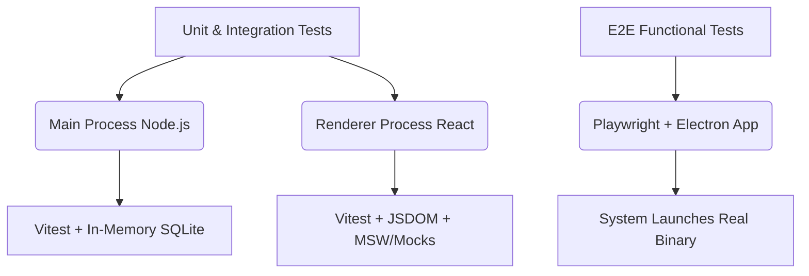

# KPT Billing - Developer Testing Strategy & Guide

This document describes the automated testing architecture, runner mechanics, and testing workflows for the Krishnapriya Textiles (KPT) Billing & Inventory Management system.

---

## 1. Testing Architecture

The codebase has three primary automated testing layers to guarantee correctness, reliability, and security across the Electron main (Node.js) and renderer (React/Vite) boundaries:



### A. Main Process (Backend) Tests

- **Purpose:** Validates SQL schemas, repository database logic, services, settings, and secure IPC handler routing.
- **Framework:** **Vitest**
- **Environment:** Runs directly inside the **Electron Node.js environment** via our custom wrapper `scripts/test-main.js`. This resolves Native Module ABI mismatches (e.g. `better-sqlite3` compiled for Electron).
- **Database:** Executes queries against isolated in-memory SQLite instances using a real, seedable test helper ([db-test-helper.ts](file:///d:/sultan/kpt_billing/src/main/database/__tests__/db-test-helper.ts)).

### B. Renderer Process (Frontend) Tests

- **Purpose:** Verifies components, layout UI states, global stores (Zustand), and React event handlers.
- **Framework:** **Vitest** + **React Testing Library**
- **Environment:** **jsdom**
- **Mocks:** Intercepts Electron preload bridge calls (`window.api`) globally through a unified test setup file ([setup.ts](file:///d:/sultan/kpt_billing/src/renderer/src/__tests__/setup.ts)).

### C. End-to-End (E2E) Tests

- **Purpose:** Verifies high-level user flows (e.g., launching the app, passing PIN gate, and transaction processing).
- **Framework:** **Playwright Test** (using `@playwright/test` for Electron)
- **Environment:** Launches the actual built Electron application window and performs programmatic clicks/interactions.

---

## 2. Test Execution Commands

We've configured NPM scripts for ease of use. All commands should be run from the root of the project:

### Run All Unit and Integration Tests

```bash
npm run test
```

_Executes both main process and renderer unit tests in single-run mode._

### Run E2E Tests

```bash
npm run test:e2e
```

_Prerequisite: The application must be built (`npm run build`) before running E2E tests._

### Run the Full Pipeline (Unit + Integration + E2E)

```bash
npm run test:all
```

_Executes all unit tests first, and if they pass, executes the E2E tests._

### Watch & Development Modes

For a fast-feedback cycle during development:

- **Watch Main Process:**
  ```bash
  npm run test:main
  ```
- **Watch Renderer Process:**
  ```bash
  npm run test:web
  ```

### Generate Coverage Reports

```bash
npm run test:coverage
```

---

## 3. Best Practices & Guidelines

### A. Writing Repository Tests (Main Process)

Always use the `createSeededTestDb()` helper to ensure you start with an isolated database in-memory:

```typescript
import { createSeededTestDb, insertTestProduct } from '../__tests__/db-test-helper'

describe('MyRepository', () => {
  let db: Database.Database

  beforeEach(() => {
    db = createSeededTestDb() // Isolated for each test case
  })
})
```

### B. Testing IPC Handlers

When verifying IPC handler registration, mock the `electron` package at the top level and retrieve the registered callback from the mock map. Reference the mocked module using `vi.mocked` to customize stub behaviors:

```typescript
import { vi, describe, it, expect } from 'vitest'
import { registerSettingsIpc } from './settings.ipc'
import { settingsRepo } from '../database/repositories/settings.repo'

vi.mock('../database/repositories/settings.repo', () => ({
  settingsRepo: { get: vi.fn() }
}))

it('delegates ipc call', async () => {
  registerSettingsIpc()
  vi.mocked(settingsRepo.get).mockReturnValue('mockValue')
  // ... invoke handler ...
})
```

### C. Mocking Renderer Preload APIs

When testing UI components, any call to `window.api` needs to be mocked in `src/renderer/src/__tests__/setup.ts` to prevent runtime errors:

```typescript
// Example from setup.ts:
const mockApi = {
  products: {
    search: vi.fn()
    // ...
  }
}
Object.defineProperty(window, 'api', { value: mockApi })
```
